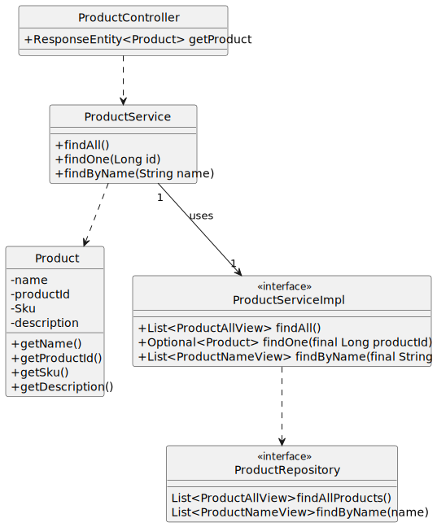

#US05 - To search the catalog of products

## 1. Requirements Engineering

### 1.1. User Story Description

As anonymous or registered customer I want to search the catalog of products by product name
or bar code

### 1.2. Customer Specifications and Clarifications

From the specifications document:

By simplicity, a product comprehends a productID, a name, a description, and a SKU.
The anonymous or registered customer can search a product by Id or Name

### 1.3. Acceptance Criteria

*Search by product name or bar code.

### 1.4. Found out Dependencies

* The list of products has to be shown first.

### 1.5 Input and Output Data

Input Data:

* Typed data in postman:
    * {{host}}{{baseUrl}}/products/(productId)
    * {{host}}{{baseUrl}}/products/(productName)
    

### 1.6. System Sequence Diagram (SSD)

## 2. OO Analysis

### 2.1. Relevant Domain Model Excerpt

### 2.2. Other Remarks

n/a

## 3. Design - User Story Realization

## 3.1. Sequence Diagram (SD)

## 3.2. Class Diagram (CD)

