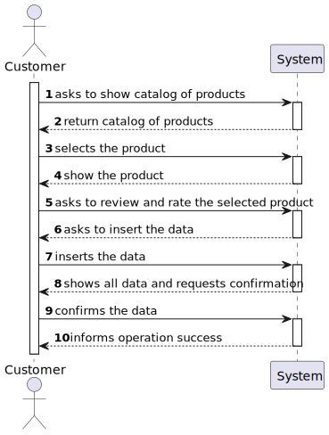
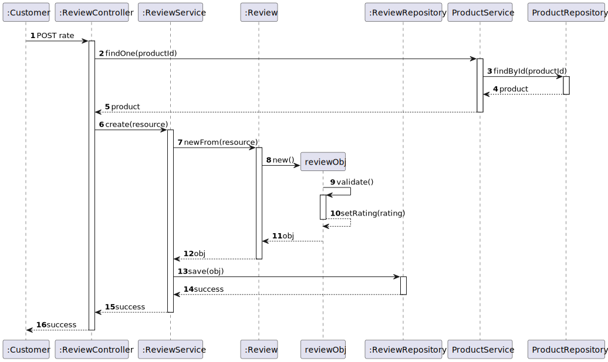
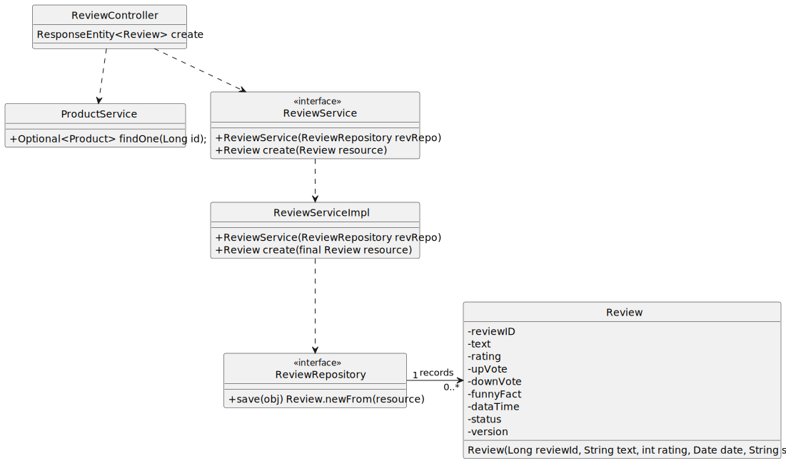

#US01 - To review and rate products

## 1. Requirements Engineering

### 1.1. User Story Description

As  a  registered customer, I want to review and rate a product.

### 1.2. Customer Specifications and Clarifications

From the specifications document:

By simplicity, a product can be rated and have a review.

From the client clarifications:

### 1.3. Acceptance Criteria

N/A.

### 1.4. Found out Dependencies

* At least one product has to be created.
    

### 1.6. System Sequence Diagram (SSD)

## 2. OO Analysis

### 2.1. Relevant Domain Model Excerpt

## 3. Design - User Story Realization

## 3.1. Sequence Diagram (SD)

## 3.2. Class Diagram (CD)

