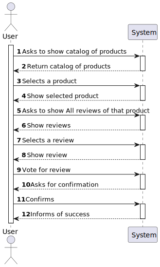
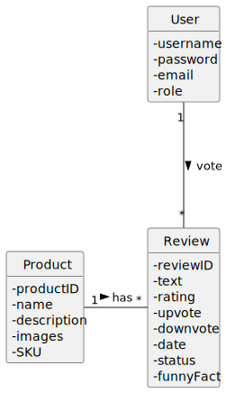
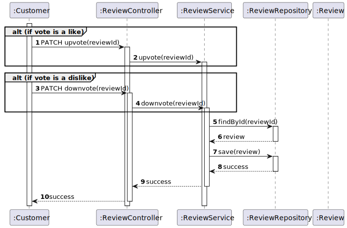
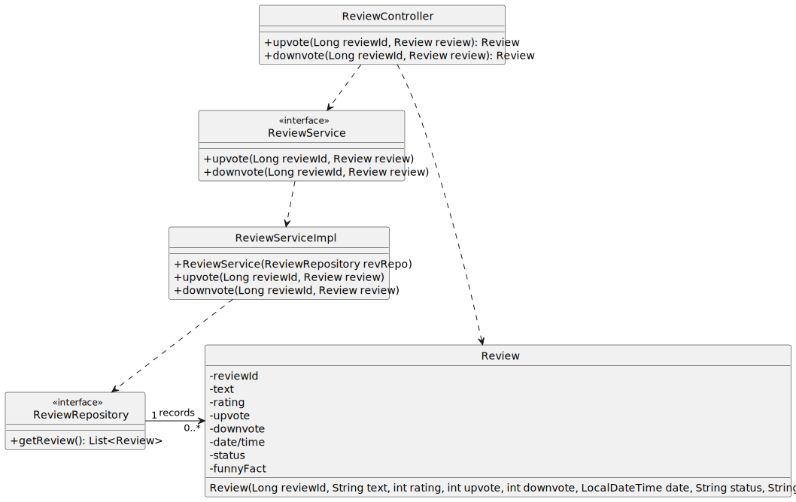

#US01 - to vote for a review

## 1. Requirements Engineering

### 1.1. User Story Description

As registered customer I want to vote for a review

### 1.2. Customer Specifications and Clarifications

From the specifications document:

By simplicity, a product needs to have a review, that can be voted by the registered customer

From the client clarifications:

### 1.3. Acceptance Criteria

*Can upvote or downvote a review.

### 1.4. Found out Dependencies

* At least one product needs to have a review.

### 1.5 Input and Output Data

Input Data:

* Typed data in postman:
    * review id

Output Data:

* review with the respective vote.

### 1.6. System Sequence Diagram (SSD)

### 1.7 Other Relevant Remarks

* A product in the list can have more than one review to be voted

## 2. OO Analysis

### 2.1. Relevant Domain Model Excerpt

## 3. Design - User Story Realization

## 3.1. Sequence Diagram (SD)

## 3.2. Class Diagram (CD)

