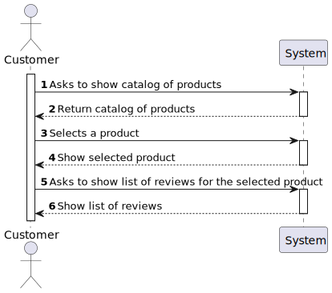
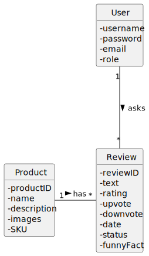
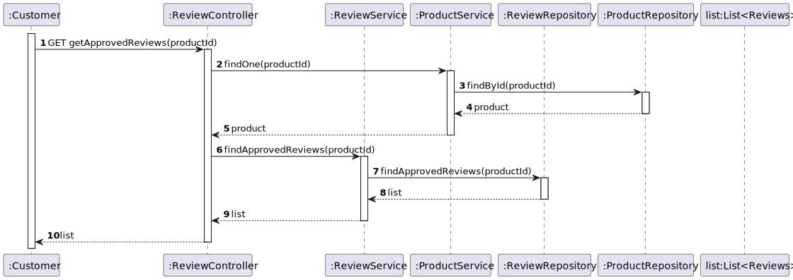
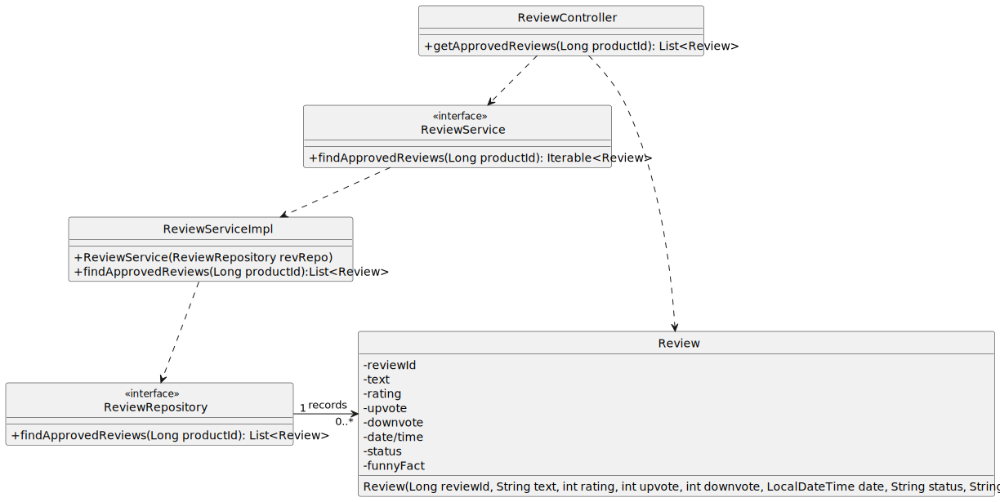

#US03 -  to obtain the reviews of a product

## 1. Requirements Engineering

### 1.1. User Story Description

As anonymous or registered customer I want to obtain the reviews of a product, sorted by number
of votes and reverse chronological publishing date.

### 1.2. Customer Specifications and Clarifications

From the specifications document:

By simplicity, a product needs to have one or more reviews

From the client clarifications:

### 1.3. Acceptance Criteria

*A registered customer needs to post a review of any product.

### 1.4. Found out Dependencies

* At least one product needs to have a review.

### 1.5 Input and Output Data

Input Data:

* Typed data in postman:
    * product id

Output Data:

* List of reviews

### 1.6. System Sequence Diagram (SSD)

### 1.7 Other Relevant Remarks

* none

## 2. OO Analysis

### 2.1. Relevant Domain Model Excerpt

## 3. Design - User Story Realization

## 3.1. Sequence Diagram (SD)

## 3.2. Class Diagram (CD)

