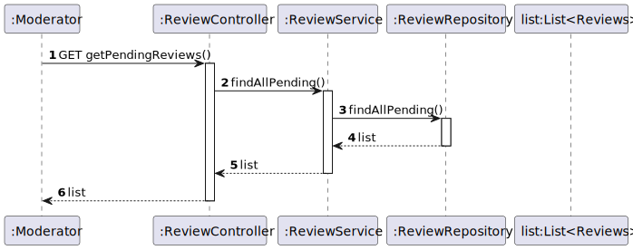

#US08 - To obtain all pending reviews

## 1. Requirements Engineering

### 1.1. User Story Description

As  a modetator, I want to obtain the all pending reviews.

### 1.2. Customer Specifications and Clarifications

From the specifications document:

By simplicity, a review needs to be in pending status.

From the client clarifications:

### 1.3. Acceptance Criteria

*Shows the list of pending reviews.

### 1.4. Found out Dependencies

* At least one product with a review has to be created.

### 1.5 Output Data

Output Data:

* List of pending reviews.

### 1.6. System Sequence Diagram (SSD)

### 1.7 Other Relevant Remarks

* None

## 2. OO Analysis

### 2.1. Relevant Domain Model Excerpt

## 3. Design - User Story Realization

## 3.1. Sequence Diagram (SD)

## 3.2. Class Diagram (CD)

