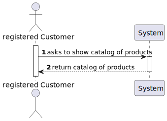
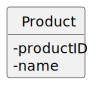
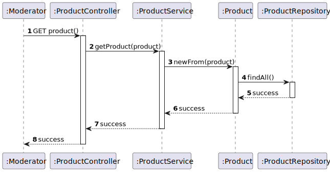
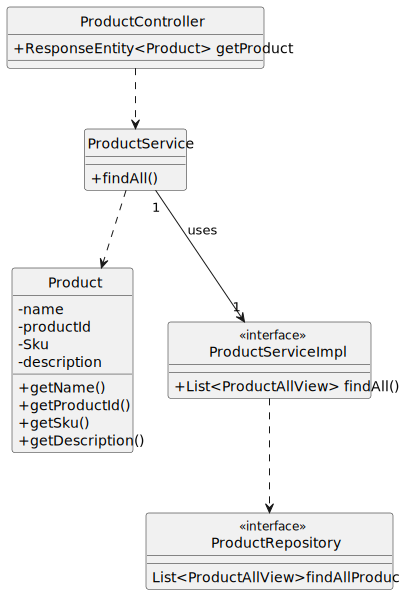

#US03 - To obtain the catalog of products

## 1. Requirements Engineering

### 1.1. User Story Description

As  an  anonymous or registered customer, I  want  to obtain the catalog of products.

### 1.2. Customer Specifications and Clarifications

From the specifications document:

By simplicity, a product just comprehends a Name and a SKU. If we open the item, it then comprehends a productID, a name, a description,  and a SKU.

From the client clarifications:

### 1.3. Acceptance Criteria

*Shows the list of the products that have been posted by the Admin.

### 1.4. Found out Dependencies

* At least one product has to be created.

### 1.5 Input and Output Data

Input Data:

* Typed data in postman:
    * {{host}}{{baseUrl}}/products
    

### 1.6. System Sequence Diagram (SSD)

### 1.7 Other Relevant Remarks

* A product in the list can be chosen to show details.

## 2. OO Analysis

### 2.1. Relevant Domain Model Excerpt

## 3. Design - User Story Realization

## 3.1. Sequence Diagram (SD)

## 3.2. Class Diagram (CD)

