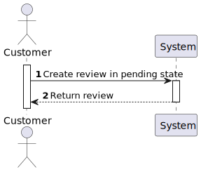
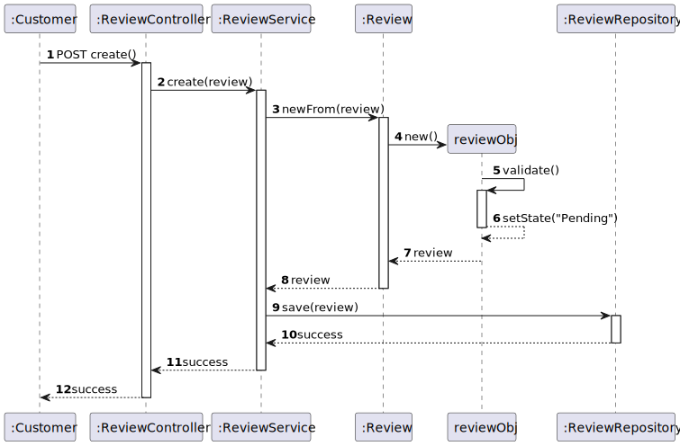
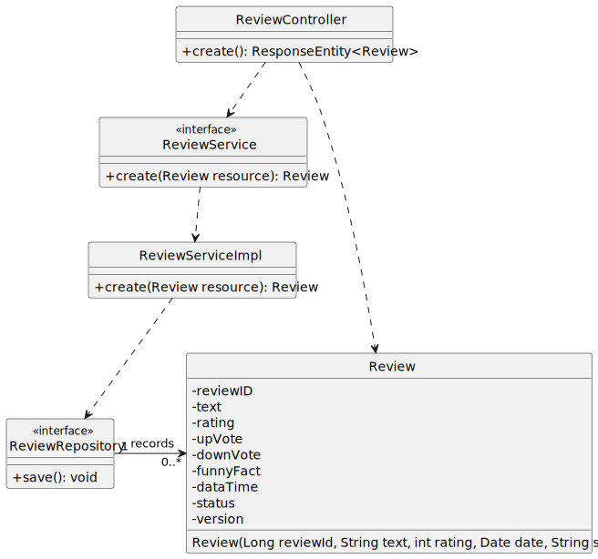

#US07 - To obtain all reviews to be created

## 1. Requirements Engineering

### 1.1. User Story Description

As  a system, I want all reviews to be created in a pending state requiring moderation.

### 1.2. Customer Specifications and Clarifications

From the specifications document:

By simplicity, a review needs to be created and aproved by the moderator.

From the client clarifications:

### 1.3. Acceptance Criteria

*Shows the list of the products with a pending review.

### 1.4. Found out Dependencies

* At least one product needs to have a review.

### 1.5 Input and Output Data

Input Data:

* Typed data in postman:
    * text
    * rating
    * date
    * status
    
Output Data:

* Shows the pending reviews

### 1.6. System Sequence Diagram (SSD)

### 1.7 Other Relevant Remarks

* Its possible to have more than one pending review to be aproved by the moderator.

## 2. OO Analysis

### 2.1. Relevant Domain Model Excerpt

## 3. Design - User Story Realization

## 3.1. Sequence Diagram (SD)

## 3.2. Class Diagram (CD)

