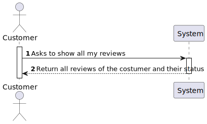
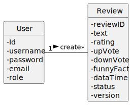
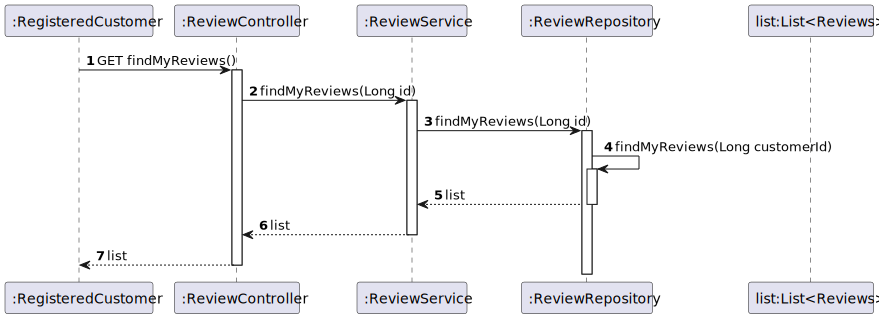
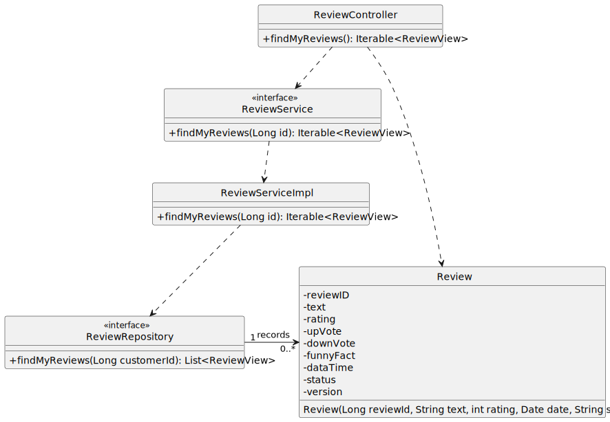

#US010 - To obtain all the reviews including their status

## 1. Requirements Engineering

### 1.1. User Story Description

As a registered customer, I want to obtain all my reviews including their status.

### 1.2. Customer Specifications and Clarifications

From the specifications document:

By simplicity, a review needs to be in created by the registered customer.

From the client clarifications:

### 1.3. Acceptance Criteria

*Shows the list of the registered customer reviews with the respective status.

### 1.4. Found out Dependencies

* The registered customer needs to create at least one review.

### 1.5 Input and Output Data

Input Data:

* Typed data in postman:
    * status

Output Data:

* Shows the list of registered customer reviews including their status.

### 1.6. System Sequence Diagram (SSD)

### 1.7 Other Relevant Remarks

* The registered customer can have more than one review, and one can be pending although one or others reviews could be already can be already approved or reject by the moderator.

## 2. OO Analysis

### 2.1. Relevant Domain Model Excerpt

## 3. Design - User Story Realization

## 3.1. Sequence Diagram (SD)

## 3.2. Class Diagram (CD)

