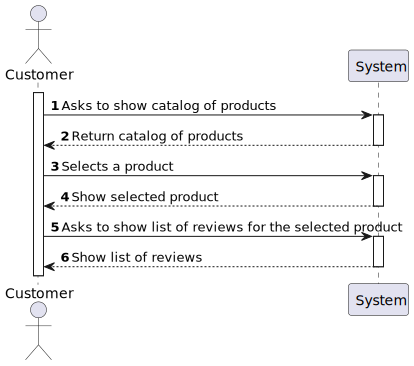
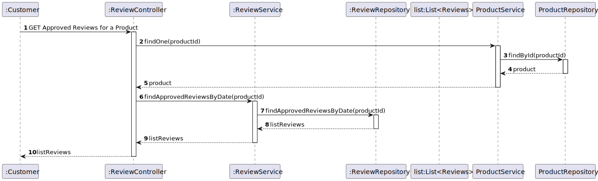
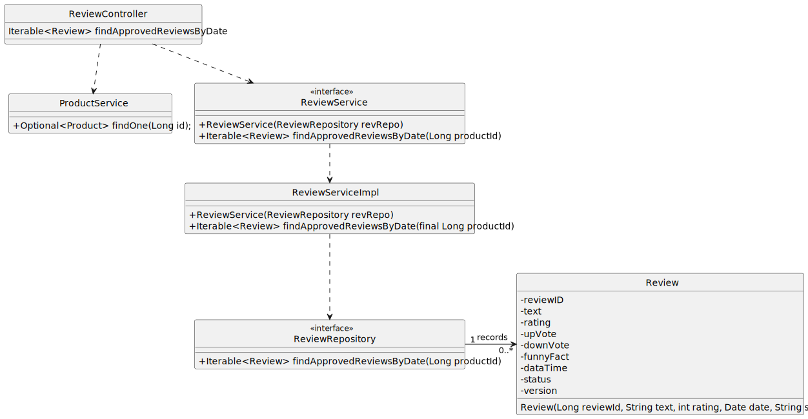

#US02 - To obtain the reviews of a product

## 1. Requirements Engineering

### 1.1. User Story Description

As  an anonymous or a registered customer, I want to obtain the reviews of a product. The return must
be sorted in reverse chronological publishing date.

### 1.2. Customer Specifications and Clarifications

From the specifications document:

By simplicity, a product needs to have a review that can be seen by an anonymous or a registered customer.

From the client clarifications:

### 1.3. Acceptance Criteria

*Shows the list of the reviews of a product sorted in reverse chronological publishing date.

### 1.4. Found out Dependencies

* At least one product needs to have a review.

### 1.6. System Sequence Diagram (SSD)

## 2. OO Analysis

### 2.1. Relevant Domain Model Excerpt

## 3. Design - User Story Realization

## 3.1. Sequence Diagram (SD)

## 3.2. Class Diagram (CD)

